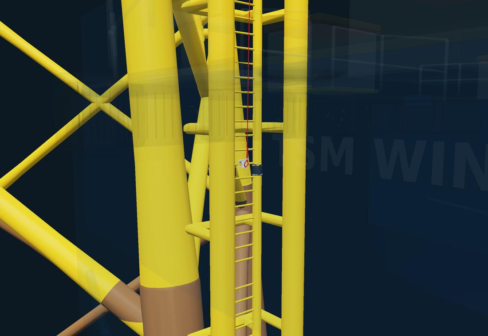
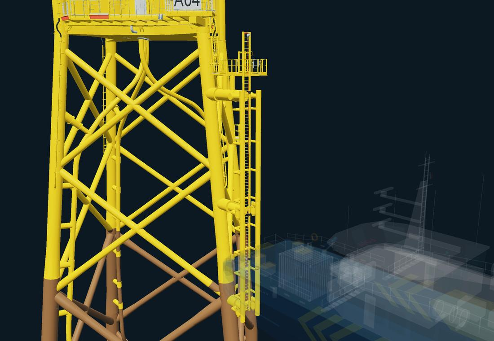
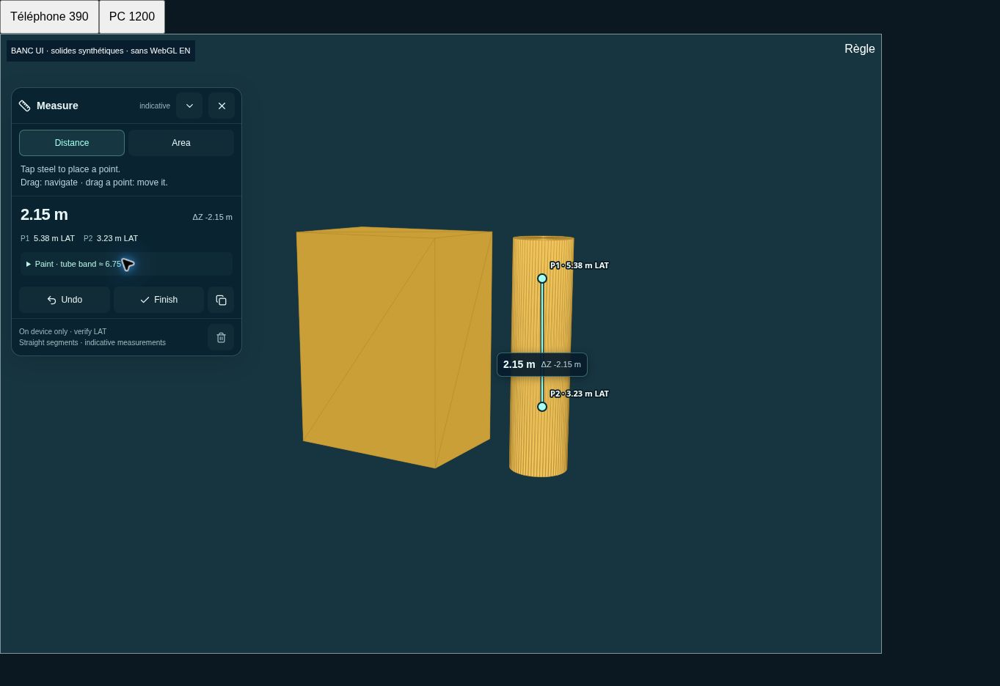
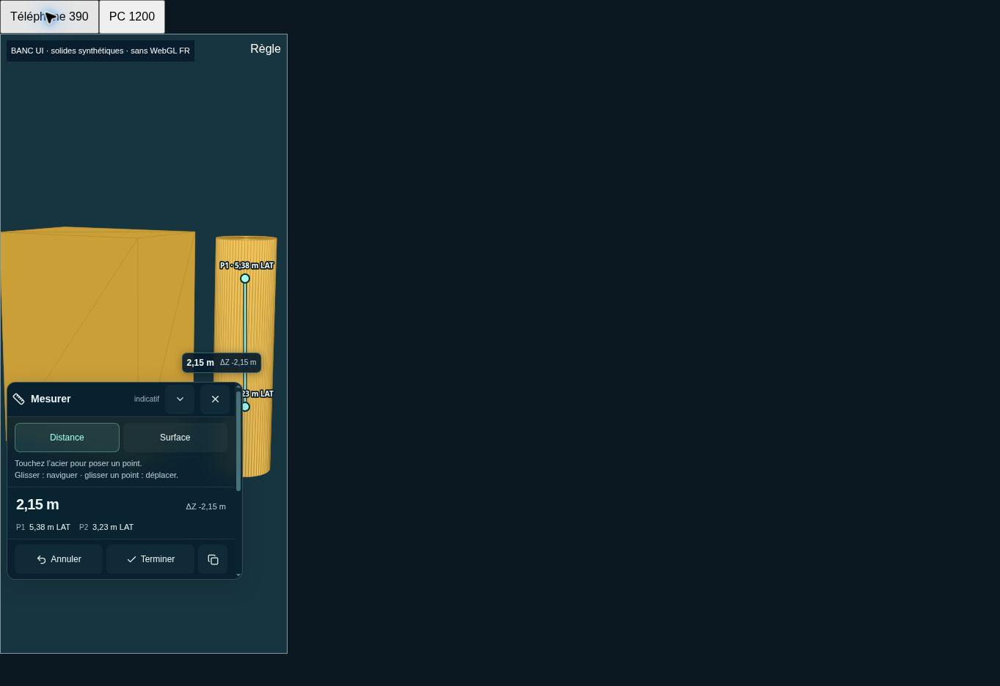

# TEST — Tether line et mesures

Ce dossier contient la source du nouveau cycle `/3D/test/`. La promotion du TEST visuel validé vers `/3D/` a été livrée séparément dans la PR #3. Ne pas remplacer la production avec ce cycle sans validation.

## Comportement

- Corde rouge de diamètre géométrique 14 mm, conservé du modèle précédent. Cosse, manchon, bride et matériaux conservés ; terminaison orientée vers le haut, plus de bout libre sous le clamp.
- Œil du clamp : 3,50 m LAT provisoire, cote fournie par le propriétaire. Extrémité haute : `(0,059 ; 22,48 ; 15,05)` m dans le repère de scène, sur la partie basse du crochet sous le SRL, identifiée visuellement sur la CAO. Identification et position à confirmer (ordre de grandeur ±5 cm). Courbure discrète, déport maximal ajouté 9 cm transversal / 7 cm vers l'avant ; pas de simulation d'effort.
- Aucun recalage du jacket : `Y_LAT = Y_STEP / 1000 + 0,4445 m`, hypothèse existante, non certifiée. L'alignement modèle/LAT reste à valider.
- Vue BL élargie pour inclure le SRL. Vue Tether oblique avant bâbord, œil dégagé. WC59 en poussée, affiché par défaut ; opacité 10 % en BL / 5,5 % en Tether pour la lecture. Collisions caméra conservées.
- Le diamètre réel de la corde n'est pas modifié. Comme les garde-corps validés, sa couverture visuelle minimale est stabilisée à distance (1,4 pixel physique, expansion de rayon plafonnée à 3 cm). Aucun déplacement de la géométrie utilisée pour les mesures.

## Mesures

Bouton règle, Distance ou Surface. Tap/clic = ajouter ; glisser = naviguer ; glisser un point existant = déplacer sur la surface. Deux doigts continuent à naviguer. Échap ferme le panneau en conservant les annotations. On peut réutiliser un point enregistré en le touchant sans le déplacer. Terminer conserve la mesure et commence un tracé vide.

Les mesures vivent uniquement dans la mémoire de l'onglet : aucune transmission, aucun enregistrement distant ou local persistant. Rechargement/déconnexion = perte des mesures. La copie est déclenchée explicitement par l'utilisateur et reste dans son presse-papiers. Les appels météo existants ne reçoivent aucune coordonnée de mesure.

- **Distance** : longueur 3D de segments droits, pas une longueur géodésique sur l'acier ; somme de polyligne, ΔZ signé et cote LAT de chaque point, affichage à deux décimales.
- **Surface** : polygone simple, fermeture par P1 ou Terminer. Aire dans le plan de Newell et périmètre 3D ; croisements/points alignés refusés. En cas de non-planéité, l'interface indique une aire projetée et l'écart au plan. Ce n'est pas une aire développée sur une surface courbe.
- **Peinture** : cercle ajusté aux intersections géométriques de la section du tube, avec rejet des plaques, coins et sections insuffisamment observées. Vérification par 24 sondes autour de la section. Deux points sur des cylindres compatibles donnent diamètre approximatif, circonférence et aire de bande complète, sans déduction des colliers ni obstacles. La continuité du tube entre points doit être vérifiée. Pour un tube incliné, longueur axiale = ΔLAT / |axe vertical| ; pas de proposition pour les tubes quasi horizontaux.
- **Aimantation** : arêtes franches (dièdre ≥30°) et sommets proches, rayon de 9 pixels CSS, surface visible. Diagonales de triangulation lisse exclues. Le maillage métrique est l'autorité ; l'amplification visuelle des éléments fins n'entre pas dans les mesures.
- **Loupe tactile** : agrandissement de l'image déjà affichée, sans second moteur 3D. En mode safe, copie immédiatement après le dessin avant l'effacement du tampon. Aucun OffscreenCanvas ajouté au mode safe.
- Les annotations restent visibles en naviguant ; les points masqués par la structure sont indiqués en pointillés. Le panneau liste les mesures, avec suppression individuelle, annulation, effacement et copie. Interface FR/EN.
- Si le modèle de secours est remplacé par le vrai modèle après la pose de points, ces mesures sont effacées avec un message : leurs surfaces de référence ont changé.

## Accès et déploiement

Les sept ressources chiffrées et le manifeste sont repris octet pour octet du TEST validé. Même AES-GCM, PBKDF2 600 000 itérations, même mot de passe, même accès mémorisé. Aucun mot de passe ni GLB en clair dans la source, le build ou le ZIP.

1. Installer les dépendances avec le lockfile fourni.
2. `npm run typecheck`
3. `npm run build:test` → `out-test/` (base Vite `/3D/test/`).
4. Remplacer uniquement le contenu de `public/3D/test/` dans le dépôt principal ; supprimer les anciens bundles hachés devenus inutiles.
5. Conserver `/3D/`, `/3d/index.html`, `/3d/test/index.html`, le site principal et `.github/workflows/deploy.yml`.

La PR TEST est basée sur la branche `main` après la promotion #3 ; elle ne change aucun fichier de production. Ne pas exécuter `build:pages` pour livrer ce cycle sans validation préalable.

## Contrôles et limites

52 tests automatisés réussis, dont mesures 3D, polygones concaves/non plans, rejet des croisements, détection/rejet de cylindres, déplacement de points, fermeture par P1, tests sur le vrai GLB déchiffré en mémoire, visibilité de l'œil en BL/Tether, caméras hors WC59, chiffrements et mécanismes de récupération existants. TypeScript et build Vite vérifiés.

Exemple de contrôle sur le vrai tube BL : diamètre maillé ajusté ≈0,4504 m aux cotes 3,50 et 7,80 m. Il ne s'agit pas d'un diamètre nominal de fabrication certifié. Sur 96 échantillons intérieurs du cordage, distance minimale au jacket ≈0,106 m (hors terminaison et assemblage clamp ajouté).

Le navigateur de contrôle n'a pas WebGL disponible. Les interactions, traductions et formats 390×844 / 1200×844 ont été contrôlés dans le navigateur sur des composants réels et un banc de solides synthétiques. Le repli 2D du site reste fonctionnel. Les images du jacket avec WC59 sont des rendus géométriques Mesa EGL : pas des captures du rendu Three.js final, ni une mesure de performance mobile. Validation GPU et confort tactile sur le téléphone réel à poursuivre dans ce TEST ; 60 fps non mesurés ici.

## Images de contrôle

Rendus géométriques du vrai jacket avec WC59, sans eau ni shaders Three.js :

Banc d’interaction avec solides synthétiques (ce n’est pas la fondation du site) :

