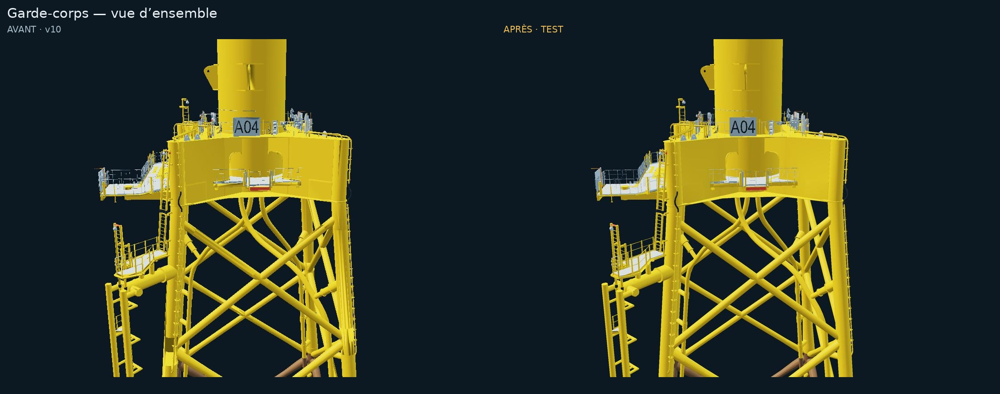
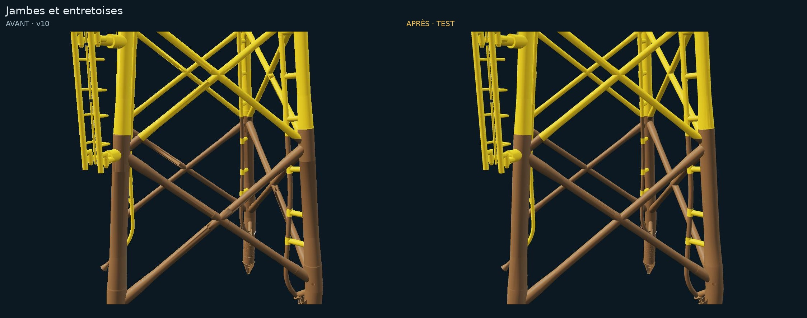
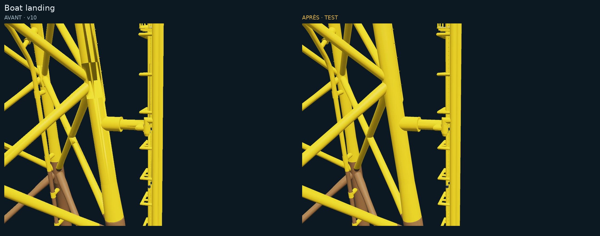
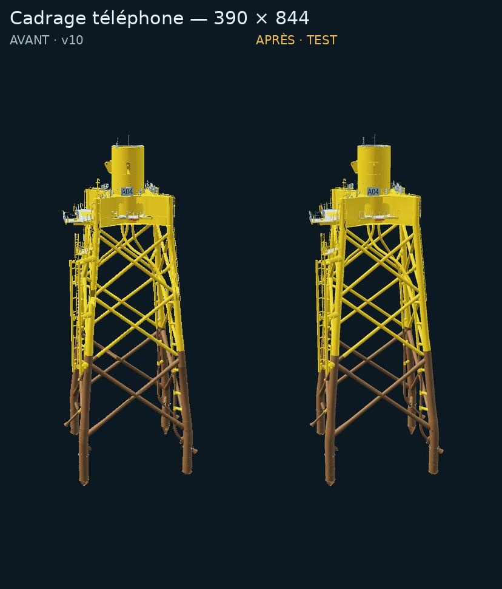

# Qualité visuelle — TEST séparé

Cette livraison ajoute uniquement `public/3D/test/`, la redirection `public/3d/test/` et ce dossier de revue. Elle part du commit `4e3a985fe8edb582ed517e25c731c52f19289c8d` de la PR #1. Les fichiers existants de `/3D/`, `/3d/`, du site principal, de `/test/`, du workflow, du fingerprint, du CNAME et des configurations racines restent identiques.

Après fusion de cette PR, le workflow Pages existant publie le TEST à **https://boatlandingometer.info/3D/test/**. La PR seule ne déploie pas cette URL. `/3d/test/` conserve paramètres et ancre en redirigeant vers la casse correcte. Aucun changement de visibilité ni de publication Sites.

## Changements

- Jacket : nettoyage des triangles dégénérés et doublons, réorientation des faces contredisant les normales CAO, puis recalcul des normales avec un seuil de 35°. Dernier nettoyage après quantification. 767 506 → **647 547 triangles**, 7 → **9 primitives**, GLB Meshopt **5 688 892 octets**.
- **147 profils tubulaires** reconstruits en sections circulaires régulières de 24 côtés, à partir de composants droits identifiés dans le modèle. Ils sont regroupés en deux primitives supplémentaires, sans 147 appels de dessin. Le 90e percentile de l’écart radial de chaque ajustement reste sous **1,38 mm**. Les assemblages ambigus ne sont pas reconstruits.
- Profils reconstruits éloignés : diamètre visuel minimal de 1,4 pixel physique, augmentation du rayon limitée à 3 cm. C’est une aide de couverture raster ; le maillage utilisé pour le clic et les collisions conserve ses dimensions métriques. Cette correction devient nulle de près et est désactivée en mode safe.
- MSAA demandé au contexte WebGL2 et au renderer. Le nombre d’échantillons réellement accordé dépend du navigateur/GPU. Aucun post-traitement lourd ajouté.
- DPR progressif de 1 à 2, plafonné à 2,7 millions de pixels. Hystérésis : baisse par pas de 0,25 après deux fenêtres lentes de 4 s, remontée après quatre fenêtres rapides. Les premières 12 s sont exclues. Une adaptation de DPR ne recentre plus la caméra.
- Acier peint plus satiné, éclairage moins surexposé, environnement de ciel filtré calculé une fois et régénéré après restauration de contexte, ombres PCF adoucies du CTV. Eau : normales moins agressives avec mipmaps et anisotropie plafonnée à 4, distorsion réduite.
- Conservation des gardes de resize, worker, watchdog 3 s, repli 2D, secours procédural et `?safe=1` / `?mode=2d`.

## Accès et cotes

Même mot de passe et même coffre que la production : AES-256-GCM, PBKDF2-SHA-256 **600 000 itérations**. Identifiant, sel et contrôle du coffre conservés pour réutiliser le choix « se souvenir ». Seul le jacket a été rechiffré avec un nouvel IV aléatoire et un nouveau nom de fichier. Les six autres ressources chiffrées restent identiques. Aucun secret ni modèle GLB en clair dans cette PR ou l’archive livrée.

Le raccordement reste **Y_LAT = Y_STEP / 1000 + 0,4445 m**, provisoire, non certifié. Ni échelle générale ni transformation LAT changées. Le repère 23 m, les coupes/cotes au clic, les surfaces coniques de référence, les caméras et le contact du fender sur les deux tubes restent couverts par les tests.

## Comparaisons et limites de validation

**Les images ci-dessous sont des rendus de contrôle géométrique EGL hors navigateur, et non des captures du rendu Three.js final.** Le navigateur de contrôle ne fournit pas WebGL. Même modèle source, caméra, résolution de sortie et éclairage dans chaque paire ; l’après utilise un rendu à double résolution puis réduction pour contrôler les silhouettes lissées. Le shader de ce banc est simplifié : eau, environnement PBR Three.js, HUD, CTV et stabilisation subpixel du moteur ne sont pas représentés. Les images ne prouvent donc ni le MSAA effectif du navigateur, ni les performances, ni la disparition complète du scintillement en mouvement.

### Garde-corps à distance

### Jambes et entretoises

### Boat landing

### Format téléphone

44 tests automatisés réussis ; TypeScript et build `/3D/test/` réussis. `gltf-validator` : 0 erreur, 0 avertissement (le validateur signale qu’il ne vérifie pas lui-même l’extension Meshopt ; le décodage et les raycasts sont testés avec le loader Three.js/Meshopt réel). Le navigateur a confirmé le repli 2D et la réactivité de BL et du calendrier après passage de 390 à 1200 px.

À vérifier sur Chrome avec GPU : garde-corps en mouvement, absence des artefacts sombres observés, reflets et ombres, reprise de contexte, fluidité sur téléphone milieu de gamme. **60 fps est un objectif, pas un résultat mesuré ici.** Certains accessoires et garde-corps complexes restent issus du maillage décimé ; ce TEST est une réparation conservatrice, pas une reconstruction paramétrique complète du jacket. Si ces zones restent bruitées, l’étape suivante sera leur reconstruction à partir du STEP de meilleure précision (mission H ciblée), plutôt qu’un nouveau lissage global.

## Parcours TEST → production

1. Fusionner cette PR pour mettre à disposition `/3D/test/`, puis comparer avec `/3D/` aux mêmes cadrages sur les appareils de l’équipe.
2. Conserver les évolutions suivantes dans le dossier TEST et une nouvelle PR. La branche de production n’est jamais mise à jour automatiquement à partir du TEST.
3. Seulement après validation explicite, repartir des sources TEST fournies et lancer `pnpm install --frozen-lockfile`, puis `pnpm build:pages` : la base devient `/3D/`. Ne pas copier tel quel le build TEST en production, ses chemins ont la base `/3D/test/`.
4. Dans une PR de promotion séparée, copier `out-pages/` dans `public/3D/` **en conservant le sous-dossier `test/` existant**. Avec rsync : `rsync -a --delete --exclude '/test/' out-pages/ CHEMIN_DU_DEPOT/public/3D/`. Refaire l’audit de chiffrement, comparer les hashes du site racine, relire puis fusionner manuellement.

Reconstruction du TEST depuis l’archive dédiée : `cd source`, `pnpm install --frozen-lockfile`, `pnpm build:test`. Le résultat est `out-test/`. Le dossier `deploiement/` de l’archive est également prêt à copier à la racine du dépôt GitHub. `source-changes.patch` permet de relire les modifications de code par rapport aux sources v10, sans données 3D en clair.
